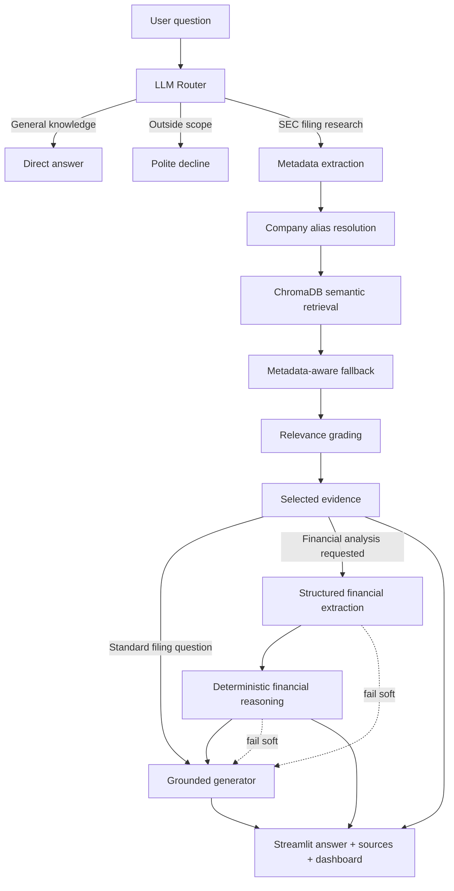

<div align="center">

# Filing Intelligence

### AI-powered research and deterministic financial analysis for SEC 10-K filings

Turn dense annual reports into source-grounded answers, calculated financial ratios, multi-year trends, and traceable evidence—through one interactive research workspace.

[](https://www.python.org/)
[](https://streamlit.io/)
[](https://www.langchain.com/langgraph)
[](https://www.trychroma.com/)
[](https://github.com/omarhicham44-ux/sec-financial-rag-omar/actions/workflows/tests.yml)

[Why it matters](#why-it-matters) · [Capabilities](#core-capabilities) · [Architecture](#system-architecture) · [Quick start](#quick-start) · [Testing](#testing)

</div>

---

## Overview

SEC Form 10-K filings are authoritative, detailed, and difficult to analyze quickly. A single filing can contain hundreds of pages covering business operations, risk factors, management commentary, financial statements, legal matters, and governance.

**Filing Intelligence** turns that document collection into an auditable research experience. Users ask questions in natural language; a LangGraph workflow classifies the request, extracts retrieval metadata, searches a ChromaDB index, grades the evidence, and produces an answer grounded in selected filing excerpts.

For financial questions, the platform goes further: it extracts standardized metrics and sends them through a deterministic Python reasoning engine. Ratios and trends are calculated from traceable inputs—not guessed by the language model.

> **The core principle:** let the LLM understand language and evidence; let deterministic code do the financial arithmetic.

## Why it matters

| Problem | Business impact | Platform response |
|---|---|---|
| Filings are long and dense | Research is slow and difficult to scale | Semantic search retrieves focused excerpts |
| Generic AI can invent facts | Answers become unsafe for serious analysis | Evidence grading and grounded generation constrain responses |
| LLM arithmetic is hard to audit | Ratios can be inconsistent or unverifiable | A deterministic engine calculates from structured source metrics |
| Company names and metadata vary | Relevant evidence can be missed | Alias resolution and metadata-aware fallback improve retrieval |
| Financial records are incomplete | False precision can mislead users | Missing data, warnings, and confidence are explicit |

## The solution

Filing Intelligence provides one workflow for qualitative research and quantitative analysis:

1. **Understand the request** — distinguish general questions, filing research, financial analysis, and unsupported requests.
2. **Find the right evidence** — extract company, fiscal year, filing section, and semantic intent before retrieval.
3. **Verify relevance** — grade candidate excerpts and discard evidence that does not materially support the question.
4. **Calculate safely** — extract standardized financial metrics and compute supported ratios using pure Python.
5. **Explain with provenance** — return a grounded answer alongside source cards, formulas, trends, confidence, and supporting records.

## Core capabilities

### Grounded filing research

- Natural-language exploration of indexed SEC Form 10-K disclosures
- LLM router with `direct`, `retrieve`, and `decline` decisions
- Structured metadata extraction for companies, years, sections, and topics
- Company alias resolution for more reliable metadata matching
- ChromaDB semantic retrieval with progressively relaxed fallback filters
- Strict relevance grading before evidence reaches generation
- Source-grounded answers with document markers and filing metadata
- Explicit abstention when available evidence is insufficient

### Financial intelligence

- Structured extraction of 13 standardized financial metrics
- Year-over-year revenue growth
- Gross, operating, net profit, and free cash flow margins
- Operating cash flow quality
- Liability pressure and equity position
- R&D and sales-and-marketing intensity
- Multi-year trend classification
- Strengths, weaknesses, and interpretation warnings
- Missing-metric reporting and incompatible-unit protection
- Confidence scoring based on period coverage and source support
- Supporting metric records linked to retrieved documents

### Interactive research workspace

- Streamlit conversational interface
- Route and evidence transparency
- Source cards for retrieved filing excerpts
- Financial KPI tiles and interactive Plotly charts
- Company tabs for multi-company analysis
- Trend summaries, strengths, weaknesses, and warnings
- Expandable evidence tables with document references

## Financial metrics and calculations

| Statement area | Extracted metrics |
|---|---|
| Income statement | Revenue, gross profit, operating income, net income, earnings per share |
| Cash flow | Operating cash flow, free cash flow |
| Balance sheet | Cash and cash equivalents, total assets, total liabilities, stockholders' equity |
| Operating investment | Research and development, sales and marketing |

| Analysis | Deterministic formula |
|---|---|
| Revenue growth | `(current revenue - prior revenue) / abs(prior revenue)` |
| Gross margin | `gross profit / revenue` |
| Operating margin | `operating income / revenue` |
| Net profit margin | `net income / revenue` |
| Free cash flow margin | `free cash flow / revenue` |
| Cash flow quality | `operating cash flow / net income` |
| Liability pressure | `total liabilities / total assets` |
| Equity position | `stockholders' equity / total assets` |
| R&D intensity | `research and development / revenue` |
| Sales and marketing intensity | `sales and marketing / revenue` |

### Reported, calculated, and interpreted values

```text
Reported metric   → extracted directly from filing evidence
Calculated ratio  → produced deterministically from reported metrics
Interpretation    → concise description of the calculated result or trend
```

Every calculated ratio carries its formula, fiscal year, supporting inputs, units, and source-document references. Missing denominators, zero values, nonconsecutive years, and incompatible currencies or units are handled explicitly rather than estimated.

## System architecture



### How a request moves through the system

1. **Routing** — the router selects one graph path and emits a separate financial-analysis signal. Non-retrieval routes cannot enable financial analysis.
2. **Metadata extraction** — the system identifies companies, years, 10-K sections, topic, and an optimized semantic query. Company aliases resolve to canonical metadata.
3. **Retrieval with fallback** — ChromaDB combines semantic similarity with available metadata, relaxing overly restrictive filters when necessary.
4. **Corrective grading** — candidate chunks are independently graded against the original question. Only explicitly relevant evidence proceeds.
5. **Financial reasoning** — router-approved requests are normalized into company-year records; pure Python calculates ratios, trends, warnings, and confidence.
6. **Grounded generation** — one generator receives filing evidence and optional deterministic analysis. If analysis fails, the original grounded path still completes.

## Reliability by design

| Design choice | Why it matters |
|---|---|
| Evidence is graded before generation | Similar text is not automatically accepted as relevant |
| Financial arithmetic is deterministic | Results are repeatable, testable, and auditable |
| Source references propagate into ratios | Calculated outputs retain provenance |
| Financial analysis is router-gated | Qualitative questions avoid unnecessary processing |
| Optional analysis fails softly | A secondary failure does not destroy a valid RAG answer |
| Missing data remains missing | The system does not manufacture financial values |
| Direct and decline paths stay isolated | Unsupported requests do not trigger retrieval workflows |

## Data coverage

| Attribute | Current corpus |
|---|---|
| Filing documents | 191 |
| Distinct companies | 190 |
| Filing type | SEC Form 10-K |
| Reporting years | 2019–2021 |
| Filing sections | Items 1 through 15, where available |
| Local index | Reproducible ChromaDB index |

The source documents include narrative and financial sections plus company, CIK, filing date, reporting period, SIC, and location metadata. Coverage varies by filing, so the system reports when a requested company, period, section, or metric is unavailable.

## Technology stack

| Layer | Technology |
|---|---|
| User experience | Streamlit, Plotly |
| Agent orchestration | LangGraph `StateGraph` |
| Language model | OpenAI-compatible Chat Completions API |
| Retrieval | ChromaDB semantic vector search |
| Text preparation | LangChain recursive text splitting |
| Data source | Historical SEC Form 10-K JSON documents |
| Validation | Typed state, structured JSON parsing, deterministic normalization |
| Testing | Python `unittest`, mocks, GitHub Actions |

## Project structure

```text
sec-financial-rag-omar/
├── .github/workflows/tests.yml   # Automated test workflow
├── agents/
│   ├── financial.py              # Structured metric extraction
│   ├── financial_reasoning.py    # Deterministic ratios and trends
│   ├── generator.py              # Grounded response generation
│   ├── grader.py                 # Corrective relevance grading
│   ├── metadata.py               # Retrieval metadata extraction
│   ├── retriever.py              # Search and fallback coordination
│   └── router.py                 # Route and financial-analysis decisions
├── data/
│   ├── company_aliases.json      # Canonical company-name mapping
│   └── sec_filings/              # 191 source filing documents
├── tests/                         # Unit and integration tests
├── app.py                         # Streamlit research workspace
├── graph.py                       # LangGraph topology
├── ingest_dataset.py              # ChromaDB ingestion pipeline
├── nodes.py                       # Workflow orchestration
├── prompts.py                     # Structured agent prompts
├── state.py                       # Shared typed graph state
├── vector_store.py                # Vector storage and search
└── requirements.txt               # Reproducible dependencies
```

## Quick start

### Prerequisites

- Python 3.12
- Credentials for an OpenAI-compatible model endpoint

### 1. Clone and create an environment

```bash
git clone https://github.com/omarhicham44-ux/sec-financial-rag-omar.git
cd sec-financial-rag-omar
python -m venv .venv
```

Activate on Windows:

```powershell
.venv\Scripts\Activate.ps1
```

Activate on macOS or Linux:

```bash
source .venv/bin/activate
```

### 2. Install dependencies

```bash
python -m pip install --upgrade pip
pip install -r requirements.txt
```

### 3. Configure the model

Copy `.env.example` to `.env` and replace the placeholders:

```env
GENERATIVE_ENGINE_API_KEY=your_api_key
GENERATIVE_ENGINE_BASE_URL=https://your-compatible-endpoint.example/v1
```

The active model name is configured in [`llm.py`](llm.py).

### 4. Build the vector index and run

```bash
python ingest_dataset.py
streamlit run app.py
```

The generated `chroma_db/` directory remains local because it can be reproduced from the included filing dataset.

## Example questions

### Filing research

- What does ANSYS do?
- What risk factors did Salesforce report?
- Summarize Riot Blockchain's business model.
- What legal proceedings were disclosed in the filing?

### Financial analysis

- Compare Salesforce revenue growth across the available fiscal years.
- How did operating margin and net profit margin change over time?
- Does operating cash flow support reported net income?
- What does the balance sheet suggest about liability pressure?
- How intensive were R&D and sales-and-marketing spending relative to revenue?

## Reusable structured output

The financial analysis result is designed for dashboards, APIs, reports, and later analytical features:

```json
{
  "company": "Example Company",
  "fiscal_years_used": [2020, 2021],
  "calculated_ratios": [
    {
      "name": "revenue_growth",
      "fiscal_year": 2021,
      "comparison_year": 2020,
      "value": 0.18,
      "display_unit": "percent",
      "formula": "(current_revenue - previous_revenue) / abs(previous_revenue)",
      "status": "calculated",
      "supporting_metrics": []
    }
  ],
  "trends": [],
  "strengths": [],
  "weaknesses": [],
  "warnings": [],
  "missing_metrics": [],
  "reasoning_summary": "Concise calculation summary",
  "confidence": {
    "score": 0.87,
    "level": "high",
    "supported_input_ratio": 1.0
  },
  "supporting_metric_records": []
}
```

The schema example is illustrative; its numbers do not represent a company in the bundled dataset.

## Testing

The suite mocks model and retrieval dependencies and makes no live API calls:

```bash
python -m unittest discover -s tests -v
```

Coverage includes router validation, all supported ratios, multi-year trends, missing and incompatible data, source propagation, confidence, optional generator context, and fail-soft behavior. GitHub Actions runs the same suite on pushes and pull requests targeting `main`.

## Current scope and limitations

- The historical knowledge base currently covers reporting years 2019–2021.
- Retrieval is semantic vector search with metadata-aware fallback; it is not hybrid BM25/vector search.
- Financial values are extracted only when supported by selected filing excerpts.
- Free cash flow is extracted when explicitly reported; it is not inferred from missing capital-expenditure data.
- The platform does not currently provide forecasting, valuation, live market data, or investment recommendations.
- Output quality depends on the coverage and clarity of indexed filing sections.

## Responsible use

This project is an analytical and educational tool for historical filing research. It does not provide personalized investment advice. Verify material conclusions against the original SEC filing before making financial, legal, or compliance decisions.

## Author

Built by **[Omar Hicham](https://github.com/omarhicham44-ux)** as an end-to-end demonstration of agentic RAG, financial NLP, deterministic analytics, and trustworthy AI system design.
